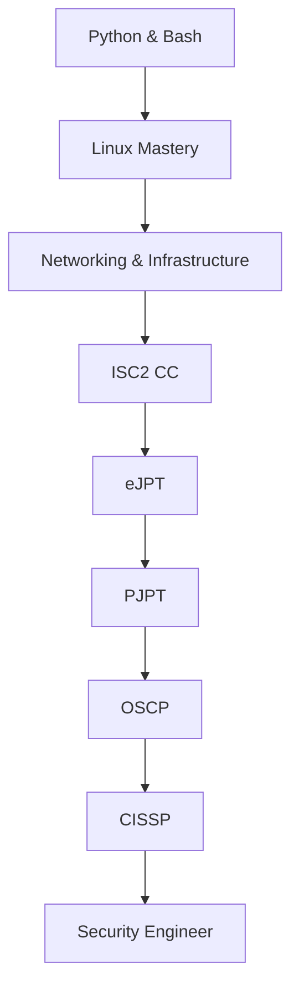

<!-- AEGIS v1.0 | Autonomous Ethical Guardian Intelligence System -->

<p align="center">
  
</p>

<p align="center">
  
  
</p>

```bash
┌──[AEGIS]──(operator@sethji-x)-[~/mission]
└─$ whoami
Akshat Aggarwal — Cybersecurity Student | Offensive Security Focus
```

---

### MODULE 00 — BOOT LOADER
**System Status:** Online  
**Uptime:** Since Oct 2025  
**Core:** Python • Bash • Linux

---

### MODULE 01 — ATLAS AI
> "Adaptive Threat & Learning Assistance System"  
> *Onboard AI Assistant for continuous learning and ethical security operations.*

**Current Directive:** Learn relentlessly. Build responsibly. Secure ethically.

---

### MODULE 02 — whoami

```bash
┌──[AEGIS]──(operator@sethji-x)-[~]
└─$ cat profile.txt
Name          : Akshat Aggarwal
Role          : Cybersecurity Student
Focus         : Offensive Security & Defensive Operations
Platform      : Linux (Kali / Ubuntu)
Primary Lang  : Python, Bash
```

---

### MODULE 03 — MISSION CONTROL (Career Roadmap)



---

### MODULE 04 — MODULES LOADED (Active Operations)

| Operation | Status | Version | Language | Description |
|---------|--------|--------|----------|-----------|
| **[Overlord-C2-Framework](https://github.com/sethji-x/Overlord-C2-Framework)** | Active | v0.1 | Python | Educational remote monitoring framework |
| **[-SysWatch](https://github.com/sethji-x/-SysWatch)** | Active | v0.2 | Python + ML | AI-powered security monitoring system |
| **[Advance-Port-Scanner](https://github.com/sethji-x/Advance-Port-Scanner)** | Active | v1.0 | Python | Multi-threaded recon tool with service detection |

---

### MODULE 05 — LEARNING MATRIX

**Current Focus**  
- Advanced Linux internals & scripting  
- Network reconnaissance & enumeration  
- Web application security  

**Next Targets**  
- ISC2 Certified in Cybersecurity (CC)  
- eJPT → PJPT → OSCP pathway  

---

### MODULE 06 — SYSTEM TELEMETRY


---

### MODULE 07 — COMMAND CENTER

<p align="center">
  <a href="https://github.com/sethji-x"></a>
  <a href="https://www.linkedin.com/in/akshat-aggarwal-cyber/"></a>
  <a href="https://tryhackme.com/p/sethji.x"></a>
  <a href="https://app.hackthebox.com/profile/drSHADOW"></a>
  <a href="mailto:aggarwalsahab2707@gmail.com"></a>
</p>

---

### MODULE 08 — SHUTDOWN SEQUENCE

```bash
┌──[AEGIS]──(operator@sethji-x)-[~]
└─$ logout

Saving session...
Stopping ATLAS AI...
Disconnecting from secure channel...
System Halted.

Goodbye, Operator.
Stay ethical. Stay sharp.
```

---

**AEGIS System v1.0** | Built with precision • Maintained with discipline