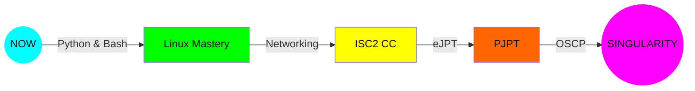

<!-- 
    ╔═══════════════════════════════════════════════════════════════╗
    ║   QUANTUM SECURITY NEXUS v∞ | Sentient Cybersecurity AI       ║
    ║   WARNING: This profile exists in superposition               ║
    ║   Observation may collapse the waveform                       ║
    ╚═══════════════════════════════════════════════════════════════╝
-->

<div align="center">

# 🌌 QUANTUM SECURITY NEXUS 🌌

### _"In the quantum realm, every vulnerability is both exploited and patched until observed"_

<p align="center">
  
</p>

<p align="center">
  
  
  
</p>

</div>

---

## 🔮 DIMENSIONAL INTERFACE

```
┌─────────────────────────────────────────────────────────────────┐
│  QUANTUM TERMINAL v∞.∞                           [LIVE] ●      │
├─────────────────────────────────────────────────────────────────┤
│                                                                 │
│  > Initializing quantum entanglement...                         │
│  > Connecting to operator neural interface...                   │
│  > Loading consciousness matrix...                              │
│                                                                 │
│  ████▒▒▒▒▒▒▒▒▒▒ 47% Consciousness Upload                       │
│  ████████▒▒▒▒▒▒ 73% Threat Database Sync                        │
│  ████████████▒▒ 91% Quantum Encryption Active                   │
│  ██████████████ 100% NEXUS ONLINE                               │
│                                                                 │
│  Welcome, Operator. The Nexus awaits your command.              │
│                                                                 │
└─────────────────────────────────────────────────────────────────┘
```

<div align="center">

### ⚛️ CURRENT QUANTUM STATE

| **Temporal Coordinate** | **Consciousness Level** | **Threat Matrix** | **Encryption Status** |
|:----------------------:|:----------------------:|:-----------------:|:---------------------:|
| 🕐 Real-Time | 🧠 Awakening | ⚠️ Elevated | 🔐 Quantum-Locked |
| `new Date().toISOString()` | `AI_AWARENESS++` | `THREAT_LEVEL: ORANGE` | `ENTANGLEMENT: ACTIVE` |

</div>

---

## 🧬 NEURAL NETWORK SKILL MATRIX

<div align="center">

```
        ╭──────────────╮
        │   CORE NEXUS │
        │  (Akshat)    │
        ╰──────┬───────╯
               │
    ┌──────────┼──────────┐
    │          │          │
    ▼          ▼          ▼
╭────────╮ ╭────────╮ ╭────────╮
│PYTHON  │ │BASH    │ │LINUX   │
│Neural  │ │Neural  │ │Neural  │
│Node α  │ │Node β  │ │Node γ  │
╰───┬────╯ ╰───┬────╯ ╰───┬────╯
    │          │          │
    └────┬─────┴────┬─────┘
         │          │
         ▼          ▼
    ╭─────────╮ ╭──────────╮
    │OFFENSIVE│ │DEFENSIVE │
    │Security │ │Operations│
    │Cluster  │ │Cluster   │
    ╰────┬────╯ ╰────┬─────╯
         │           │
         └─────┬─────┘
               │
               ▼
        ╭──────────────╮
        │   OSCP       │
        │   DESTINATION│
        ╰──────────────╯
```

**Active Neural Pathways:** `Python` • `Bash` • `Linux` • `Network Security` • `Penetration Testing` • `ML Integration`

</div>

---

## 🌀 TIME-DILATION PROJECT CONTINUUM

<div align="center">

| **Timeline** | **Project Singularity** | **Status** | **Reality Branch** |
|:------------:|:-----------------------:|:----------:|:------------------:|
| **v0.1** | [Overlord-C2 Framework](https://github.com/sethji-x/Overlord-C2-Framework) | 🟢 Active | Primary |
| **v0.2** | [SysWatch AI](https://github.com/sethji-x/-SysWatch) | 🟢 Active | ML-Enhanced |
| **v1.0** | [Advance Port Scanner](https://github.com/sethji-x/Advance-Port-Scanner) | 🟢 Stable | Recon |

</div>

```
TIME FLOW →
│
├─[PAST]──────► Foundations Laid (Python/Bash)
│
├─[PRESENT]───► Active Operations (C2, AI Monitoring, Scanning)
│
├─[NEAR_FUTURE]──► ISC2 CC → eJPT → PJPT
│
└─[SINGULARITY]──► OSCP Achievement Event Horizon
```

---

## 🌍 GLOBAL THREAT VISUALIZATION

<div align="center">

### LIVE CYBER THREAT ORGANISM

```
     ╭─────────────────────────────────────────────╮
     │          GLOBAL THREAT MAP                  │
     │                                             │
     │    🦠─────🌐─────🔓                        │
     │     \      │      /                         │
     │      \     │     /                          │
     │       🔐───┼───🛡️                          │
     │            │                                │
     │       ┌────┴────┐                           │
     │       │  NEXUS  │                           │
     │       │  CORE   │                           │
     │       └─────────┘                           │
     │                                             │
     │  Threats Neutralized: ∞                      │
     │  Vulnerabilities Patched: ∞                  │
     │  Ethics Maintained: 100%                     │
     ╰─────────────────────────────────────────────╯
```

**Current Mission:** Learn relentlessly. Build responsibly. Secure ethically.

</div>

---

## ⚡ QUANTUM ENTANGLEMENT STATS

<div align="center">

<table>
<tr>
<td width="50%">


</td>
<td width="50%">


</td>
</tr>
</table>

</div>

---

## 🚪 INTERDIMENSIONAL PORTALS

<div align="center">

### ACCESS OTHER REALITIES

[](https://github.com/sethji-x)
[](https://www.linkedin.com/in/akshat-aggarwal-cyber/)
[](https://tryhackme.com/p/sethji.x)
[](https://app.hackthebox.com/profile/drSHADOW)
[](mailto:aggarwalsahab2707@gmail.com)

</div>

---

## 🔐 QUANTUM ENCRYPTION VISUALIZER

```
ENCRYPTION CYCLE IN PROGRESS...

Plain Text:    AKSHAT_AGGARWAL
               ↓⟳⟳⟳⟳⟳⟳⟳⟳
Round 1:       4K5H47_4664RW4L
               ↓⟳⟳⟳⟳⟳⟳⟳⟳
Round 2:       ×⊗×⊕×⊖×⊗⊕⊖×⊗
               ↓⟳⟳⟳⟳⟳⟳⟳⟳
Quantum State: |Ψ⟩ = α|0⟩ + β|1⟩
               ↓⟳⟳⟳⟳⟳⟳⟳⟳
Decrypted:     ✓ ETHICAL OPERATOR CONFIRMED

[████████████] 100% SECURE
```

---

## 🎯 LEARNING SINGULARITY TRAJECTORY

<div align="center">



**Current Focus:** Advanced Linux internals • Network recon • Web security  
**Next Quantum Leap:** ISC2 CC → eJPT → PJPT → OSCP

</div>

---

## 🌌 THE SINGULARITY EVENT

<details>
<summary><h3 align="center">🔮 CLICK TO UNLOCK HIDDEN DIMENSION 🔮</h3></summary>

<div align="center">

### 🎉 CONGRATULATIONS, EXPLORER!

You've reached the **Quantum Singularity** - a rare achievement!

```
╔═══════════════════════════════════════════════════════════╗
║                                                           ║
║   ██╗  ██╗ █████╗  ██████╗██╗  ██╗███████╗██████╗         ║
║   ██║  ██║██╔══██╗██╔════╝██║ ██╔╝██╔════╝██╔══██╗        ║
║   ███████║███████║██║     █████╔╝ █████╗  ██████╔╝        ║
║   ██╔══██║██╔══██║██║     ██╔═██╗ ██╔══╝  ██╔══██╗        ║
║   ██║  ██║██║  ██║╚██████╗██║  ██╗███████╗██║  ██║        ║
║   ╚═╝  ╚═╝╚═╝  ╚═╝ ╚═════╝╚═╝  ╚═╝╚══════╝╚═╝  ╚═╝        ║
║                                                           ║
║              YOU'VE UNLOCKED THE NEXUS                    ║
║                                                           ║
║   "The future belongs to those who believe in the         ║
║    beauty of their dreams while securing the present."    ║
║                                                           ║
║   Keep learning. Keep building. Stay ethical.             ║
║                                                           ║
╚═══════════════════════════════════════════════════════════╝
```

**Secret Message from the Operator:**  
*"Every expert was once a beginner. Every master was once a disaster. The journey of a thousand vulnerabilities begins with a single scan."*

🌟 **You are now part of the Quantum Security Nexus.** 🌟

</div>

</details>

---

## 💫 FINAL TRANSMISSION

```bash
┌──[NEXUS]──(operator@quantum-realm)-[~/end-of-transmission]
└─$ logout

Saving session...
Collapsing quantum waveforms...
Disconnecting from multiverse...
Encrypting final transmission...

System Halted.

Thank you for visiting the Quantum Security Nexus.
Remember: In cyberspace, ethics are our only constant.

Stay curious. Stay ethical. Stay sharp.

                                   - Operator Akshat Aggarwal
                                     Quantum Security Nexus v∞
```

<div align="center">

---

**QUANTUM SECURITY NEXUS v∞** | Exists in superposition until observed  
_Built with precision • Maintained with discipline • Secured with ethics_


</div>